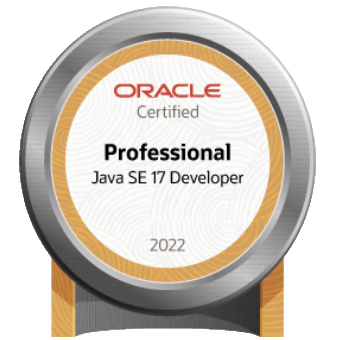
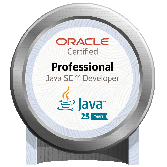

# How I prepared myself for the OCP 11/17/21 Exam

<table>
  <tr>
    <td></td>
    <td></td>
    <td></td>
  </tr>
</table>

# Table of contents
- [Exam Differences](#exam-differences)
- [Recommended Reading](#recommended-reading)
- [Study Tools](#study-tools)
- [Useful Resources](#useful-resources)
- [Practice Exams](#practice-exams)
- [Hands-on Practice](#hands-on-practice)
- [Pre-Exam Checklist](#pre-exam-checklist)
- [Personal Experience](#personal-experience)

# Exam Differences
The OCP 21 has not only changed compared to OCP 17 and OCP 11 in terms of new topics, but Oracle has also significantly
altered its way of formulating questions and answers. As a result, the exam has become considerably more difficult
compared to its predecessors. Questions and answers contain a lot of code with mixed themes, making such tasks very
time-consuming. I remember that after reaching the end of the test, I looked at a question I had marked earlier because
I wasn't sure about the answer. I analyzed each given choice and tested which one corresponded to the question. The
choices were so complex that this single question cost me almost 10 minutes.

# Recommended Reading
- [OCP Oracle Certified Professional Java SE 21 Developer Study Guide](https://www.amazon.de/Oracle-Certified-Professional-Java-Developer/dp/1394286619)

When I prepared for an OCP exam for the first time, I bought the study guide for OCP 11 and worked through it 
completely. I recommend that you always buy the most recent study guide, regardless of which Java version you want to
take the OCP for. The study guide for OCP 21 also covers all the topics that the OCP 11 or OCP 17 contains.


# Study Tools
What personally helped me a lot, and therefore I can strongly recommend, is writing flashcards. Writing something down 
again myself really helped me to better remember what I had learned. Additionally, this gives you the opportunity to go
through the flashcards repeatedly and thus recall important concepts or rules again and again. For example, I had a 
stack for questions about Java, such as what rules must be followed for switch pattern matching or what to pay attention
to with records. I had another stack with code samples and the question "why doesn't this code compile" to quickly
recognize errors in code once more. The whole thing is extremely difficult without an IDE, so without syntax
highlighting and with poorly formatted code.

I opted for virtual flashcards and used Anki. Anki is a free, open-source flashcard program. <br>
You can download it [here](https://apps.ankiweb.net/).

# Useful Resources
I used a lot of Oracle documentation, though one must be careful because the documentation is often not up-to-date,
especially when it's not the JDK documentation but rather a general description of concepts.

The following topics are absolutely necessary to pass the exam. If there are gaps in knowledge in these areas, 
the exam will quickly become very difficult to nearly impossible.

### Records
- https://docs.oracle.com/en/java/javase/21/language/records.html
### Switch Pattern Matching
- https://docs.oracle.com/en/java/javase/21/language/pattern-matching.html
- https://docs.oracle.com/en/java/javase/21/language/switch-expressions.html
### Sealed Classes
- https://docs.oracle.com/en/java/javase/21/language/sealed-classes-and-interfaces.html
### InstanceOf Operator
- https://docs.oracle.com/en/java/javase/21/language/record-patterns.html#GUID-7623D3AD-4141-4914-A384-60C65BD0C010
- https://docs.oracle.com/en/java/javase/21/language/unnamed-patterns-and-variables.html
### Text Blocks
- https://docs.oracle.com/en/java/javase/21/text-blocks/index.html
### Serialization
- https://www.oracle.com/technical-resources/articles/java/serializationapi.html
- https://medium.com/technology-times/serialization-in-java-9b91296f04ee
### Java Platform Module System
- https://www.oracle.com/corporate/features/understanding-java-9-modules.html
- https://en.wikipedia.org/wiki/Java_Platform_Module_System
### Operators
- https://en.wikipedia.org/wiki/Bitwise_operation
- https://www.javatpoint.com/bitwise-operator-in-java
### Localization
- https://docs.oracle.com/en/java/javase/21/docs/api/java.base/java/util/PropertyResourceBundle.html
- https://docs.oracle.com/en/java/javase/21/docs/api/java.base/java/util/Locale.html
### Time
- https://docs.oracle.com/en%2Fjava%2Fjavase%2F21%2Fdocs%2Fapi%2F%2F/java.base/java/time/ZonedDateTime.html
- https://docs.oracle.com/en%2Fjava%2Fjavase%2F21%2Fdocs%2Fapi%2F%2F/java.base/java/time/Period.html
- https://docs.oracle.com/en%2Fjava%2Fjavase%2F21%2Fdocs%2Fapi%2F%2F/java.base/java/time/Duration.html
### Multi-Threading
- https://docs.oracle.com/en/java/javase/21/docs/api/java.base/java/lang/Thread.html#startVirtualThread(java.lang.Runnable)
- https://docs.oracle.com/en%2Fjava%2Fjavase%2F21%2Fdocs%2Fapi%2F%2F/java.base/java/util/concurrent/locks/ReentrantReadWriteLock.html
- https://docs.oracle.com/en%2Fjava%2Fjavase%2F21%2Fdocs%2Fapi%2F%2F/java.base/java/util/concurrent/ExecutorService.html
- https://docs.oracle.com/en%2Fjava%2Fjavase%2F21%2Fdocs%2Fapi%2F%2F/java.base/java/util/concurrent/Executors.html#newWorkStealingPool(int)
### Generics
- https://docs.oracle.com/javase/tutorial/java/generics/index.html
### Streams
- https://kdaimon-8.medium.com/stream-t-and-streams-of-primitives-conversion-from-to-list-and-array-java-21-e7f8c9e50867
- https://www.baeldung.com/java-virtual-threads-parallel-collectors
- https://docs.oracle.com/en%2Fjava%2Fjavase%2F22%2Fdocs%2Fapi%2F%2F/java.base/java/util/stream/Stream.html

# Practice Exams
I strongly recommend taking mock exams to get accustomed to reading code in an editor style, that is, in black and 
white, and to familiarize yourself with the type of questions. <br>
I found [Enthuware](https://enthuware.com/) to be the best.

# Hands-on Practice
### Multi-Threading
I recommend the following, which I did myself: In my development environment, I tried out all possible variants of 
streams, especially those with downstream collectors and parallel streams. It's important to understand how a result 
can change once a stream is executed in parallel. It may sound a bit excessive, but it's best if you know the parameter 
lists of the individual method calls, such as .collect(), by heart, as the creators of the OCP exam repeatedly try to 
trick you.

The same applies to multithreading. You must execute code to understand that a thread can be interrupted by the OS 
scheduler at any time. Predicting exactly when a thread will run is absolutely impossible. Therefore, you must learn 
what a thread-safe class looks like and what properties it must have. By this, I mean locks, especially ReentrantLocks 
and synchronized blocks.

You must be sure about how serialization and deserialization work. I know, I know, I also find it odd that this is 
heavily emphasized in the exam. Just look at the custom methods for serializing and deserializing and understand 
what transient means. Don't forget that the first non-serializable superclass must have a default constructor.

### Exception Handling
Believe me when I tell you that you must know exactly when certain exceptions are suppressed in a try-catch or 
try-with-resources block, and which exception is propagated outwards. This is absolutely fundamental knowledge.

# Pre-Exam Checklist
It's not mentioned anywhere, but if you're taking your exam online, bring 3-4 blank sheets of paper and 1-2 pens with 
you. Based on my experience and that of other participants, these are allowed. However, you should still discuss it 
with the proctor during check-in or at least write in the chat that you will be using such scratch paper. This is so 
no one wonders why you keep looking down. Here you can track variables and, what helped me a lot, cross out incorrect 
answers. There are sometimes up to 9 answers, and you can quickly lose track otherwise. I have to admit that in my 
opinion, the OCP 21 is not feasible without such scratch paper. Even well-known Java champions have struggled even 
with scratch paper and have pointed out how important these sheets are.

# Personal Experience
Based on my experience, you should place special emphasis on:
- Exception Handling
- Loops and Bitwise Operators
- Complex Streams (sequential and parallel)
- Complex Inheritance Hierarchy with Records and Interfaces
- Polymorphism
- Member scope for Inner and Local classes
- Inner classes and Local classes
- Enums and complex enum fields. Consider that an Enum field can also be, for example, a BiConsumer<T,U>

# Question Examples
If you have no idea what a task in such an exam might look like, I'll give you a few examples:

### Example 1
```java
class ExceptionOne extends Exception {
    public ExceptionOne(String message) {
        super(message);
    }
}

class ExceptionTwo extends RuntimeException {
    public ExceptionTwo(String message) {
        super(message);
    }
}

class Test implements AutoCloseable {
    boolean someFlag;

    public Test(boolean someFlag) {
        this.someFlag = someFlag;
        System.out.println("opened");
    }

    public void doSomething() throws ExceptionOne {
       throw new ExceptionOne("Exception in doSomething()");
    }

    @Override
    public void close() throws ExceptionTwo {
        if(someFlag) {
            throw new ExceptionTwo("Exception in close()");
        }

        System.out.println("closed");
    }
}

public class ExceptionHandlingInTryWithResources {
    public static void main(String[] args) {
        try (Test test = new Test(true)) {
            test.doSomething();
        } catch (Exception e) {
            System.out.println(e);
        }
    }
}
```
You need to know which exception is propagated and which is suppressed.

### Example 2
```java
class SomeClass implements Serializable {
    public String name;
    public transient double price;
    public static final double AVERAGE_PRICE = 7.99;

    public SomeClass(String name, double price) {
        this.name = name;
        this.price = price;
    }

    private void readObject(ObjectInputStream ois) throws IOException, ClassNotFoundException {
        ois.defaultReadObject();
        price = AVERAGE_PRICE;
    }
}

public class ReadObjectDemo {
    public static void main(String[] args) {
        SomeClass someClass = new SomeClass("Fizz", 1.99);

        try(ObjectOutputStream oos = new ObjectOutputStream(new FileOutputStream("./someClass.txt"))) {
            oos.writeObject(someClass);
        } catch(IOException e) {
            e.printStackTrace();
        }

        try(ObjectInputStream ois = new ObjectInputStream(new FileInputStream("./someClass.txt"))) {
            SomeClass someClassRead = (SomeClass) ois.readObject();
            System.out.println(someClassRead.name + " " + someClassRead.price + " " + someClassRead.AVERAGE_PRICE);
        } catch(IOException | ClassNotFoundException e) {
            e.printStackTrace();
        }
    }
}
```
You know which object state is deserialized? No? Then read through serialization again.

### Example 3
```java
public static void main(String[] args) {
        ArrayList<String> lt1 = new ArrayList<>(List.of("Fizz", "Buzz"));

        String result = lt1.stream().parallel()
                .flatMap(a -> lt1.stream().parallel().map(b -> a + b))
                .reduce((a, b) -> a + b).get();

        System.out.println(result);
    }
```
Even if it's bad practice, you should know what happens when you execute such a statement.


